# Python_Ursina_documentation_with_examples
Esta documentación esta enfocada a como usar ursina de python, mediante ejemplos y explicaciones, complementado esta manera la documentación oficial.

# Clase 0: ¿Qué es ursina?

# Clase 1: Tú primer programa

Primero hay que hacer un entorno virtual

```
python -m venv venv
```

activar el entorno:

- **Winwdows: (powershell)**

```
.\venv\Scripts\Activate.ps1
```


Instalamos el motor

```
pip install ursina
```

tambíen hay que instalar para tener sonido (una alternativa, pero no es necesario, ya que ursina tiene para reproducir sonido)

```bash
pip install playsound
```


### Primer programa

```python
from ursina import * # Importa la aplicación del motor 

app = Ursina() # Inicializa tu aplicación Ursina

app.run() # Ejecuta la aplicación

```

El resultado es el siguiente

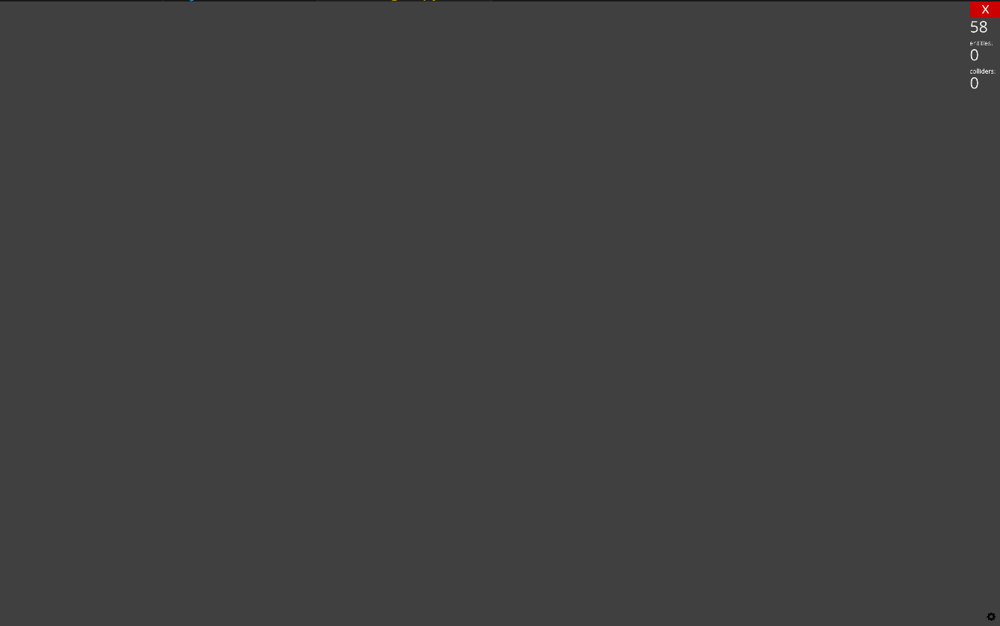

Felicidades haz hecho tu primer programa usando el motor ursina.


# 2.0 )Modelos Procedurales (Procedural Models)


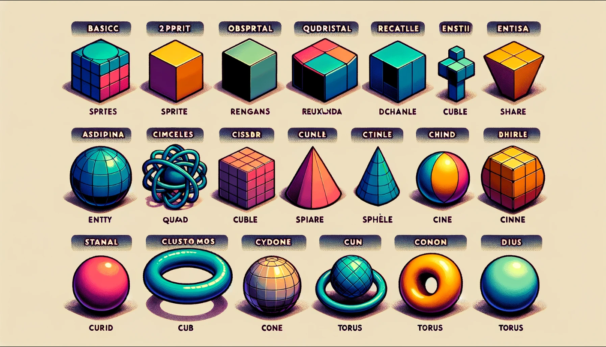

La frase "Procedural Models" se traduciría al español como "Modelos Procedurales" o "Modelos Generados Procedimentalmente". En el contexto de gráficos por computadora, los modelos procedurales son aquellos que se crean utilizando algoritmos y reglas en lugar de ser modelados manualmente, lo que permite generar geometría de manera automática y eficiente.

**Clasificación en ursina:**

Con Ursina, un motor de juego en Python, es una excelente idea para visualizar las posibilidades de este framework. Aquí tienes una tabla con ejemplos de figuras tanto en 2D como en 3D:

| Tipo de Figura | Nombre de la Figura en Ursina | Descripción                                       |
| -------------- | ----------------------------- | ------------------------------------------------- |
| 2D             | `Entity`                      | Un objeto básico 2D, puede ser un sprite.         |
| 2D             | `Quad`                        | Un cuadrilátero o rectángulo 2D.                  |
| 2D             | `Circle`                      | Un círculo 2D.                                    |
| 3D             | `Entity`                      | Un objeto básico 3D, para modelos personalizados. |
| 3D             | `Cube`                        | Un cubo 3D.                                       |
| 3D             | `Sphere`                      | Una esfera 3D.                                    |
| 3D             | `Cylinder`                    | Un cilindro 3D.                                   |
| 3D             | `Cone`                        | Un cono 3D.                                       |
| 3D             | `Torus`                       | Un toro o anillo 3D.                              |

Cada una de estas figuras se puede personalizar en Ursina con diferentes texturas, colores y transformaciones (como escala, rotación y posición).

## 2.1) Clase 2 : Cuadrilatero( Quad)

**Forma básica** 

```python
from ursina import *

app = Ursina()

# Crear un Quad de tamaño 2x1 de color rojo
quad = Entity(model='quad', scale=(2, 1), color=color.red)

app.run()
```

La forma básica sólo sirve para poder apreciar lo que es quad, sin embargo quiero que visualices toda las dimensiones y por ello he realizado un segundo código que puedes rotar la entidad  para visualizar sus dimensiones.


Ahora un ejemplo con rotación usando las flechas del teclado para mover la vista (flecha derecha,izquierda rotar con respecto al eje "y", **flecha arriba,abajo**, rotar con respecto al eje "x").

```python
from ursina import *
from time import perf_counter

def update():
    # Controlar la rotación con las flechas del teclado
    if held_keys['left arrow']:
        quad_entity.rotation_y -= 1  # Rotar a la izquierda
    if held_keys['right arrow']:
        quad_entity.rotation_y += 1  # Rotar a la derecha
    if held_keys['up arrow']:
        quad_entity.rotation_x -= 1  # Rotar hacia arriba
    if held_keys['down arrow']:
        quad_entity.rotation_x += 1  # Rotar hacia abajo

app = Ursina()

# Crear una entidad con un modelo de Quad
#quad_entity = Entity(model=Quad(scale=(3, 1), thickness=3, segments=3, mode='line'), color=color.color(0, 1, 1, .7))

# Crear otra entidad con un modelo de Quad
quad_entity=Entity(scale=(3, 1), model=Quad(aspect=3), color=color.color(60, 1, 1, .3))


# Crear una entidad para representar el origen (0, 0)
origin = Entity(model='quad', color=color.orange, scale=(.05, .05))

# Ajustar la posición de la cámara
camera.z = -5

app.run()
```

Resultado:

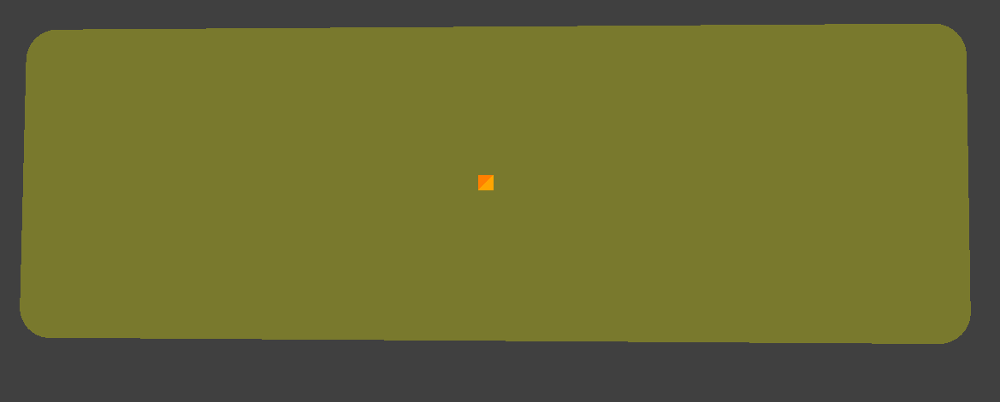

**Notas:**

- Si se comenta la línea 18 y se des comenta la línea 21 da el anterior resultado, pero si se desea un `quad` sin color en el centro y sólo el perímetro de color rojo, se comenta la línea 21 y la línea 18 se comenta dando el siguiente resultado:

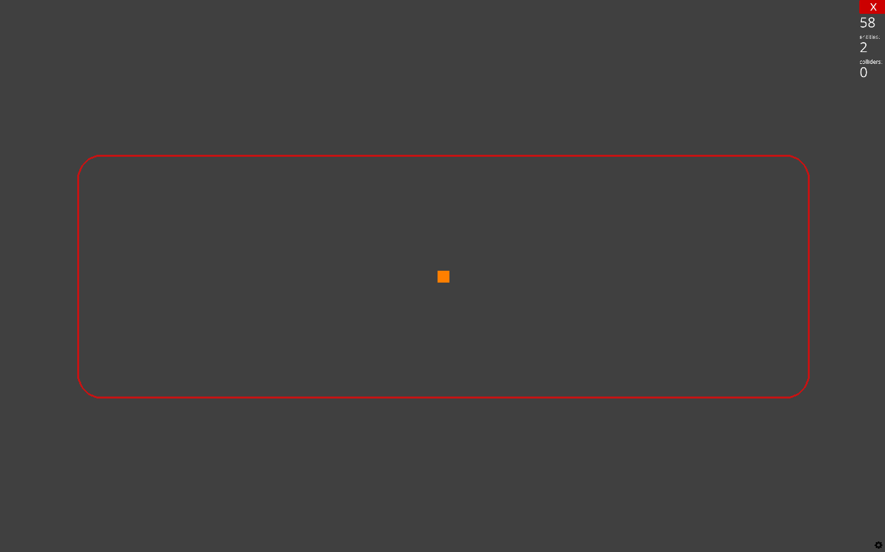

## 2.2)  Clase 3 :  Círculo  (circle)

En esta clase dibujaremos un círculo.

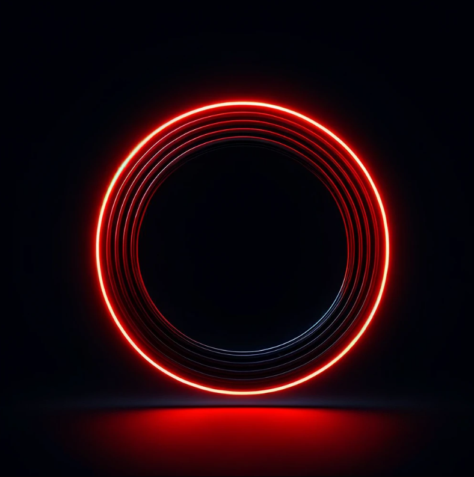

**Forma básica:**

Es la manera básica para construir un círculo  y que se muestre en la pantalla, sin más.

código: 

```python
# clase3.py
from ursina import *

app=Ursina()

entidad=Entity(model=Circle())

app.run()
```

Lo que se muestra es:


---

Sin embargo quiero analizar el ejemplo del que  es parte la documentación que es el siguiente:

```python
e = Entity(model=Circle(8, mode='line', thickness=10), color=color.color(60,1,1,.3))
print(e.model.recipe)
origin = Entity(model='quad', color=color.orange, scale=(.05, .05))
ed = EditorCamera(rotation_speed = 200, panning_speed=200)
```

Pero para visualizar sus características he colocado código adicional para poder rotar la figura (flecha derecha,izquierda rotar con respecto al eje "y", **flecha arriba,abajo**, rotar con respecto al eje "x"). El código quedaría de la siguiente manera:

```py
# clase3_con_movimiento.py
from ursina import *

def update():
    # Controlar la rotación con las flechas del teclado
    if held_keys['up arrow']:
        circle_entity.rotation_x += 1  # Rotar hacia arriba
    if held_keys['down arrow']:
        circle_entity.rotation_x -= 1  # Rotar hacia abajo
    if held_keys['left arrow']:
        circle_entity.rotation_y += 1  # Rotar a la izquierda
    if held_keys['right arrow']:
        circle_entity.rotation_y -= 1  # Rotar a la derecha

app = Ursina()

# Crear una entidad con un modelo de círculo
circle_entity = Entity(model=Circle(8, mode='line', thickness=20), color=color.color(60, 1, 1, .3))
# Imprimir la receta del modelo del círculo
print(circle_entity.model.recipe)

# Crear una entidad para representar el origen (0, 0)
origin = Entity(model='quad', color=color.orange, scale=(.05, .05))

# Usar EditorCamera para una mejor vista y navegación
ed = EditorCamera(rotation_speed=200, panning_speed=200)

app.run()

```

**El resultado:**

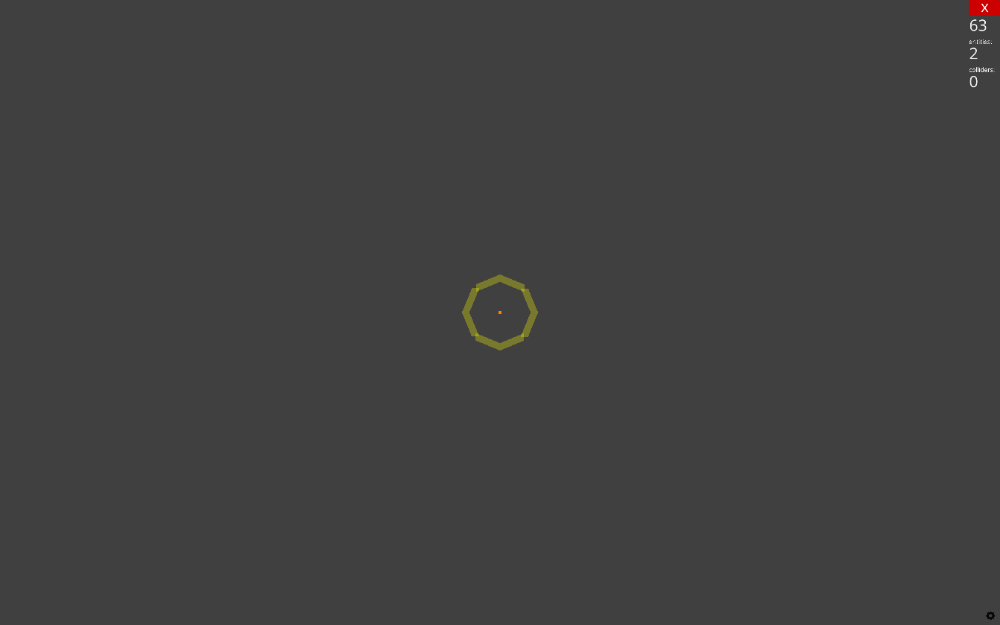

**Nota:** La resolución se refiere a cuantas líneas se usarán para conformar la figura del círculo que estamos diseñando, toma por ejemplo la siguiente figura

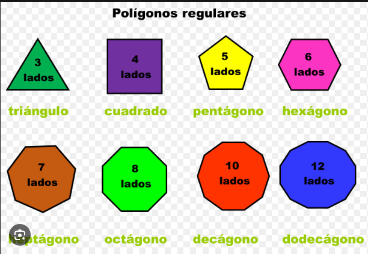

Si usáramos la resolución de 3, sería un triangulo, pero si tomaramos la resolución de 12 será un dodecágono, entre más tenga, parecerá más un círculo.

## 2.3) Clase 4 :  Plano (Plane) 

### Documentación

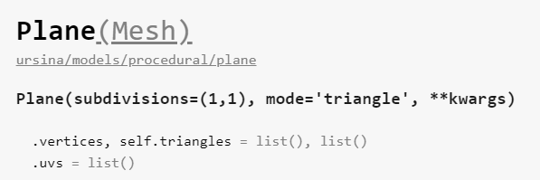

**Explicación:**

1. **Plane(Mesh):** Esta línea indica que `Plane` es una clase que hereda de `Mesh`. En Ursina, un `Mesh` es un objeto que define la forma de una entidad 3D. `Plane` es una especialización de `Mesh` que representa un plano o superficie.

2. **ursina/models/procedural/plane:** Esta es la ruta del módulo en el código fuente de Ursina donde se define la clase `Plane`.

3. **Plane(subdivisions=(1,1), mode='triangle', **kwargs):** Aquí se describe el constructor de la clase `Plane`. Puedes crear un nuevo `Plane` especificando ciertos parámetros:
   - **subdivisions=(1,1):** Este parámetro define el número de subdivisiones del plano en los ejes X e Y. Un valor de `(1,1)` significa que el plano es un cuadrado o rectángulo simple sin subdivisiones internas. Si aumentas estos valores, el plano se dividirá en más cuadrados o rectángulos, lo que puede ser útil para ciertos efectos o detalles.
   - **mode='triangle':** Este parámetro define cómo se construye el plano a nivel de malla. El valor predeterminado `'triangle'` significa que el plano se compone de triángulos. Otras opciones podrían incluir 'line' o 'point', dependiendo de cómo quieras que se visualice la malla.
   - **\*\*kwargs:** Esto significa que puedes pasar argumentos adicionales que son aceptados por la clase base `Mesh` o por otras clases de las que `Plane` podría heredar.

4. **.vertices, self.triangles = list(), list():** Aquí se inicializan las listas de vértices y triángulos del plano. 

5. **.uvs = list():** Esta línea inicializa la lista de coordenadas UV, que se utilizan para mapear texturas en la superficie del plano. 

### Código más simple

```python
# clase4.py
from ursina import *

app = Ursina()

# Crear un plano básico
plane =  Entity(model=Plane(),rotation_x=-90)

app.run()
```

**Resultado:**


Es un plano  simple sin color, de 1x1, sin embargo se necesitó rotar debido a que como el plano esta contenido hacia los vértices x,y, no se puede visualizar es por ello que se realiza una rotación de 90° para lograrlo visualizar.

### Código de la documentación

El código es obtenido de la documentación oficial:

```python
front =  Entity(model=Plane(subdivisions=(3,6)), texture='brick', rotation_x=-90)

_ed = EditorCamera()
Entity(model='cube', color=color.green, scale=.05)
```

Pero es necesario modificarlo para apreciar todas las dimensiones que posee, quedando como resultado el siguiente código:

```python
# clase4_con_movimiento.py
from ursina import *

def update():
    # Controlar la rotación con las flechas del teclado
    if held_keys['up arrow']:
        front.rotation_x += 1  # Rotar hacia arriba en el eje X
    if held_keys['down arrow']:
        front.rotation_x -= 1  # Rotar hacia abajo en el eje X
    if held_keys['left arrow']:
        front.rotation_y += 1  # Rotar a la izquierda en el eje Y
    if held_keys['right arrow']:
        front.rotation_y -= 1  # Rotar a la derecha en el eje Y

app = Ursina()

# Crear un plano con subdivisiones y aplicar una textura
front = Entity(model=Plane(subdivisions=(3,6)), texture='brick', rotation_x=-90)

# EditorCamera para una mejor vista y navegación
_ed = EditorCamera()

# Crear una entidad que representa el origen (0, 0, 0)
Entity(model='cube', color=color.green, scale=.05)

app.run()

```

###  **Resultado:**


Cómo se observa tiene textura que viene incluida en el motor de ursina, pero además tiene división 3x6 y esta rotado 90 grados, para poder visualizarse.

## 2.4) Clase 5 : Grid (Rejilla) 

Aunque claramente la traducción de **rejilla** no es precisamente correcta es el termino que más se le parece a lo que trata de representar el elemento, para mi es más fácil tratar de especificar que es este tipo de elementos a partir de un ejemplo, para ello observa las siguientes tres imágenes (viendo que tienen en común):

Imagen 1)

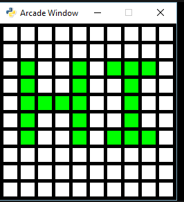

Imagen 2)

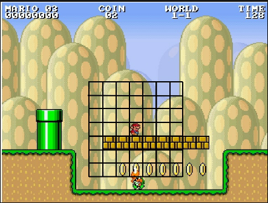

Imagen 3)


¿Lo adivinaste? Las imágenes están formadas por cuadriculas para organizar, referenciar la posición de los elementos, toma como idea el `grid` de `CSS` :

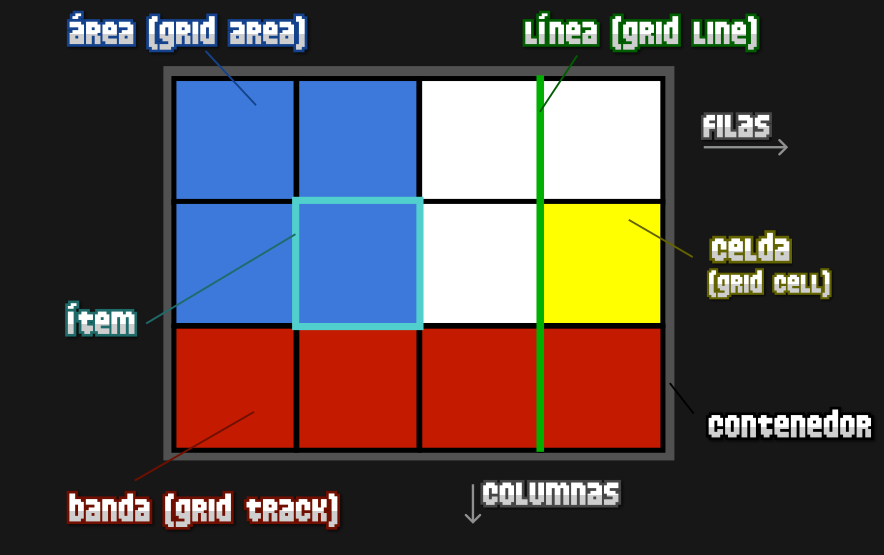

Si yo quisiera  iluminar los cuadros rojos de la imagen anterior porque es lava en un videojuego, podría usar `grid` especificando la posición de los recuadros rojos  y con ello realizar una acción, es decir que nos sirve construir el escenario que estamos planeando.

**Código básico:**

```python
# Clase5.py
from ursina import *

app = Ursina()

grid = Entity(model=Grid(2, 6))

app.run()
```

el resultado es el siguiente:

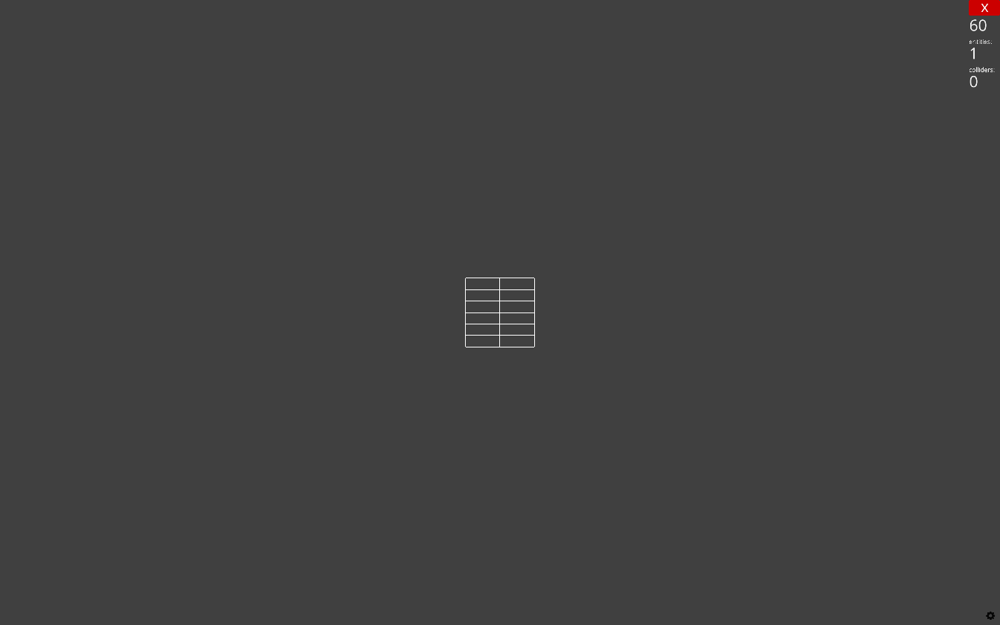

Un grid únicamente mostrando las divisiones, 2 divisiones de ancho y  6 de alto, en este caso es indispensable especificar el número de divisones tanto vertical como horizontalmente.

**Código de la documentación:**

```python
Entity(model=Grid(2, 6))
```

`Entity(model=Grid(2, 6))`: Este es un ejemplo de cómo crear una entidad (objeto en la escena) utilizando la clase `Grid` como su modelo. Aquí se crea una entidad con una rejilla que tiene una anchura de 2 unidades y una altura de 6 unidades. En `ursina`, una `Entity` es un objeto general que puede tener un modelo, una textura, una posición, etc., y al asignarle un modelo `Grid`, se convierte en una representación visual de la rejilla en la escena.

**Versión modificada del código de la documentación:**

Para el caso de este código se mostrará un caso de ejemplo de una cuadricula de colores que es posible interactuar mediante el mouse en cada uno de los diferentes cuadros (dando click izquierdo) , además es posible rotar la cuadricula con las flechas (flecha **derecha,izquierda** rotar con respecto al eje "y", **flecha arriba,abajo**, rotar con respecto al eje "x").

```python
# clase5_con_movimiento.py
from ursina import *

def update():
    # Rotar en el eje Y (izquierda / derecha)
    if held_keys['left arrow']:
        grid.rotation_y += time.dt * 100
    if held_keys['right arrow']:
        grid.rotation_y -= time.dt * 100

    # Rotar en el eje X (arriba / abajo)
    if held_keys['up arrow']:
        grid.rotation_x += time.dt * 100
    if held_keys['down arrow']:
        grid.rotation_x -= time.dt * 100

app = Ursina()

# Crear un grid
grid = Entity()

# Crear cuadrados en el grid y asignarles colores aleatorios
for y in range(5):
    for x in range(5):
        b = Button(parent=grid, position=(x, y), color=color.random_color())

# Asegurarse de que la cámara no rota con el grid
camera.parent = scene

app.run()
```

el resultado se muestra a continuación:

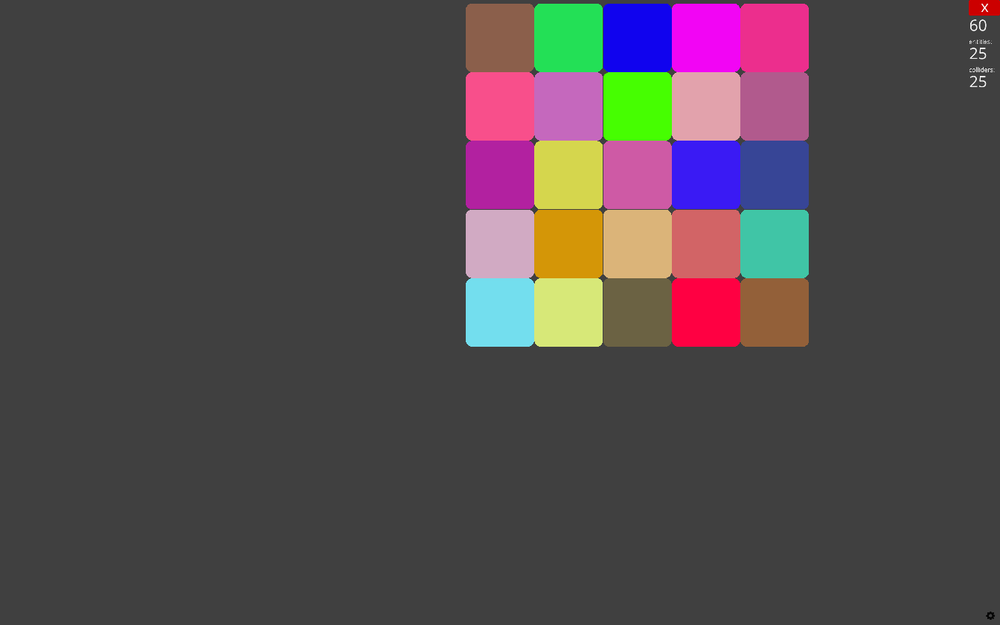

**Tomando la documentación oficial:**

Vamos a tomar la documentación para tomar esto con verdadero y extender nuestro entendimiento de clase (**puedes omitirlo si deseas**)

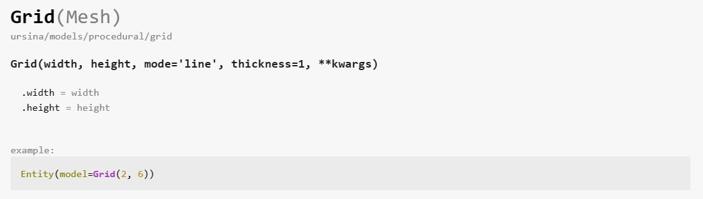

De la documentación vemos lo siguiente:

- `Grid(Mesh)`: Esto indica que `Grid` es una clase que probablemente hereda de `Mesh` o está relacionada con la creación de una malla (mesh), que es una estructura compuesta de vértices, aristas y caras que define la forma de un objeto poligonal en 3D.
- `ursina/models/procedural/grid`: Esta es la ruta donde se encuentra definida la clase `Grid` dentro de la estructura de directorios del paquete `ursina`. `models/procedural/grid` sugiere que es un modelo procedimental, es decir, que se genera automáticamente a través de código en lugar de ser modelado a mano.
- `Grid(width, height, mode='line', thickness=1, **kwargs)`: Esta es la declaración de la función constructora de la clase `Grid`. Aquí están los parámetros que puedes especificar al crear una nueva instancia de `Grid`:

  - `width`: La anchura de la rejilla en unidades de la escena.
  - `height`: La altura de la rejilla en unidades de la escena.
  - `mode='line'`: El modo en el que se dibuja la rejilla. El valor predeterminado `'line'` significa que la rejilla se representará como una serie de líneas.
  - `thickness=1`: El grosor de las líneas de la rejilla. Por defecto es 1.
  - `**kwargs`: Esto permite pasar argumentos adicionales que la clase `Grid` puede aceptar o que se pueden pasar a la clase base.
- `.width = width`: Es una propiedad de la instancia de `Grid` que define su anchura.
- `.height = height`: Es una propiedad de la instancia de `Grid` que define su altura.

## 2.5)  Clase 6:  Cone (Cono)

```python
# Importamos los componentes necesarios de Ursina
from ursina import Ursina, Entity, color, EditorCamera, held_keys

# Creamos la aplicación de Ursina
app = Ursina()

# Creamos el cono con una resolución de 3 para que sea bajo poligonal y aplicamos una textura de ladrillo
e = Entity(model=Cone(3), texture='brick')

# Creamos una entidad que sirve como el origen para la rotación
origin = Entity(model='quad', color=color.orange, scale=(.05, .05))

# Inicializamos la cámara del editor para navegar en la escena
ed = EditorCamera()

# Definimos la función update que se llama en cada cuadro
def update():
    # Rotamos el cono alrededor del eje y (vertical) cuando se presiona la flecha derecha
    if held_keys['right arrow']:
        e.rotation_y += 45 * time.dt
    # Rotamos el cono alrededor del eje y en la dirección opuesta cuando se presiona la flecha izquierda
    if held_keys['left arrow']:
        e.rotation_y -= 45 * time.dt

# Llamamos a la función run para empezar el juego
app.run()
```

**Explicación:**

En la documentación de Ursina, la propiedad `model=Cone(3)` se refiere a la creación de un modelo en forma de cono. El número `3` en `Cone(3)` especifica el número de segmentos utilizados para crear la base del cono. Esto significa que la base del cono no será un círculo suave, sino más bien un triángulo, ya que se están utilizando tres segmentos para formar la base.

Aumenta el número de manera gradual, para poder visualizar las diferencias del cono.


## 2.6)   Clase 7:  Cylinder (Cilindro)


```python
from ursina import Ursina, Entity, color, held_keys, Cylinder, EditorCamera

def update():
    # Controlar la rotación con las flechas del teclado
    if held_keys['up arrow']:
        ed.rotation_x += 1  # Rotar hacia arriba en el eje X
    if held_keys['down arrow']:
        ed.rotation_x -= 1  # Rotar hacia abajo en el eje X
    if held_keys['left arrow']:
        ed.rotation_y += 1  # Rotar a la izquierda en el eje Y
    if held_keys['right arrow']:
        ed.rotation_y -= 1  # Rotar a la derecha en el eje Y

app = Ursina()

# Crear un cilindro
cilindro = Entity(model=Cylinder(resolution=6, start=-.5), color=color.color(60,1,1,.3))

# Crear un marcador de origen para referencia
origin = Entity(model='quad', color=color.orange, scale=(5, .05))

# Usar la cámara de editor para una mejor visualización y control
ed = EditorCamera(rotation_speed=200, panning_speed=200)

app.run()
```

Ahora, al ejecutar este código y usar las flechas del teclado, la cámara girará alrededor del objeto en la escena, permitiéndote observar el cilindro desde diferentes ángulos. La cámara responderá a las entradas de las flechas del teclado de la siguiente manera:

- Flecha arriba: La cámara gira hacia arriba.
- Flecha abajo: La cámara gira hacia abajo.
- Flecha izquierda: La cámara gira hacia la izquierda.
- Flecha derecha: La cámara gira hacia la derecha.

## 2.7) Clase 8: Pipe 

```python
from ursina import Ursina, Entity, Circle, Pipe, color, EditorCamera, held_keys

def update():
    # Controlar la rotación con las flechas del teclado
    if held_keys['up arrow']:
        editor_camera.rotation_x += 1
    if held_keys['down arrow']:
        editor_camera.rotation_x -= 1
    if held_keys['left arrow']:
        editor_camera.rotation_y += 1
    if held_keys['right arrow']:
        editor_camera.rotation_y -= 1

app = Ursina()

# Generar un camino (path) utilizando los vértices de un círculo, escalados por 5
path = [vertex * 5 for vertex in Circle().vertices]

# Añadir el primer punto al final del camino para cerrar el círculo
path.append(path[0])

# Crear una entidad con el modelo de Pipe utilizando el camino generado
pipe_entity = Entity(model=Pipe(path=path, cap_ends=False))

# Imprimir la cantidad de vértices y colores del modelo
print(len(pipe_entity.model.vertices), len(pipe_entity.model.colors))

# Configurar la cámara de editor para una mejor visualización y control
editor_camera = EditorCamera(rotation_speed=200, panning_speed=200)

# Crear una entidad para marcar el origen con un cubo magenta
origin_marker = Entity(model='cube', color=color.magenta)
origin_marker.scale *= .25

app.run()

```


## 2.8 ) Clase 9:  Terrain

```python
from ursina import *
from ursina.prefabs.first_person_controller import FirstPersonController
import random

app = Ursina()

# Terreno generado a partir de una textura de mapa de altura
terrain_from_heightmap_texture = Entity(
    model=Terrain('heightmap_1', skip=8),
    scale=(40, 5, 20),
    texture='heightmap_1'
)

# Función para modificar el terreno basado en valores aleatorios
def input(key):
    if key == 'space':
        terrain_from_list.model.height_values = [[random.uniform(0, 255) for _ in column] for column in terrain_from_list.model.height_values]
        terrain_from_list.model.generate()

# Terreno generado a partir de una lista de valores de altura
hv = terrain_from_heightmap_texture.model.height_values.tolist()
terrain_from_list = Entity(
    model=Terrain(height_values=hv),
    scale=(40, 5, 20),
    texture='heightmap_1',
    x=40
)

# Crear la cámara de editor y el cielo
editor_camera = EditorCamera(rotation_speed=200, panning_speed=200)
Sky()

# Crear un jugador y asignarle el terreno como suelo
player = FirstPersonController(model='sphere', color=color.azure, scale=2, origin_y=-.5)
player.collider = 'mesh'
player.gravity = 0.5
player.ground = terrain_from_list

# Actualizar la función para incluir la rotación de la cámara con las teclas de flecha
def update():
    if held_keys['up arrow']:
        editor_camera.rotation_x -= 1
    if held_keys['down arrow']:
        editor_camera.rotation_x += 1
    if held_keys['left arrow']:
        editor_camera.rotation_y += 1
    if held_keys['right arrow']:
        editor_camera.rotation_y -= 1

    # Movimiento del jugador
    direction = Vec3(
        held_keys['d'] - held_keys['a'],
        0,
        held_keys['w'] - held_keys['s']
    ).normalized()
    player.position += direction * time.dt * 8

app.run()
```


# Bloque 2 Trasformaciones básicas

## 1.Clase 10:  Translation (Traslación)
La traslación es el proceso de mover un objeto de un lugar a otro dentro de la escena. En Ursina, esto se hace modificando las propiedades `x`, `y`, y `z` del objeto.

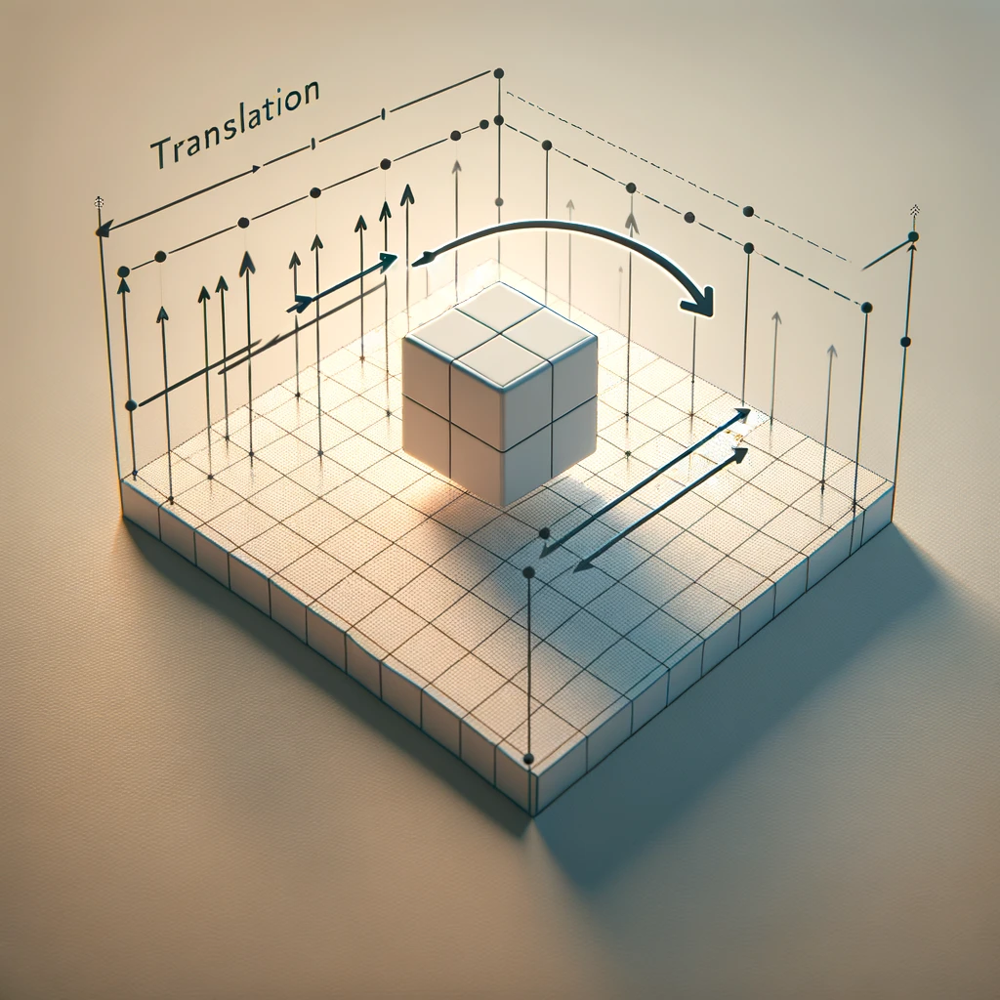

**Ejemplo:**

Basado del código dado en la documentación obtenemos el siguiente código.

```python
from ursina import *


def update():
    # Si la tecla 'a' es presionada, mueve el cubo 5 unidades a la izquierda
    if held_keys['a']:
        cube.x -= 5 * time.dt
    # Si la tecla 'w' es presionada, mueve el cubo 5 unidades hacia adelante
    if held_keys['w']:
        cube.y += 5 * time.dt
    if held_keys['s']:
        cube.y += 5 * time.dt

app = Ursina()

# Crea un cubo en la escena
cube = Entity(model='cube',texture='brick', color=color.white, scale=(1,1,1))

# Inicia la aplicación
app.run()
```

Este script crea un entorno 3D con un cubo que puede ser movido utilizando las teclas del teclado. Aquí está la descripción de lo que hace cada tecla según el código:

- **Tecla 'a'**: Al presionar esta tecla, el cubo se mueve 5 unidades hacia abajo en el eje `-x`. Esto se debe a que el valor de `y` del cubo disminuye, lo que hace que el cubo se traslade verticalmente hacia abajo en la escena.

- **Tecla 'w'**: Al presionar esta tecla, el cubo se mueve 5 unidades hacia adelante en el eje `+y`. Aumentar el valor de `z` del cubo lo traslada hacia adelante en la escena, alejándose de la cámara si esta tiene una posición fija y mira hacia el origen desde una perspectiva estándar.

- **Tecla 'd'**: Al presionar esta tecla, el cubo se mueve 5 unidades hacia la derecha en el eje `+x`. Esto se logra aumentando el valor de `x` del cubo, trasladándolo horizontalmente hacia la derecha en la pantalla.

Para este caso +x  es hacia la derecha y -x es para la izquierda des un mismo vector de dirección.

La función `update()` se ejecuta continuamente mientras la aplicación está en funcionamiento, revisando en cada fotograma si alguna de las teclas especificadas ('a', 'w', 'd') está siendo presionada. Dependiendo de la tecla presionada, el cubo se mueve en la dirección correspondiente. El uso de `time.dt` en el cálculo asegura que el movimiento del cubo sea suave y consistente, independientemente de la tasa de fotogramas del juego, adaptando la velocidad del movimiento a la duración del fotograma actual.

**Resultado:**


Al desplazar el objeto  de un lugar a otro vemos el siguiente resultado:

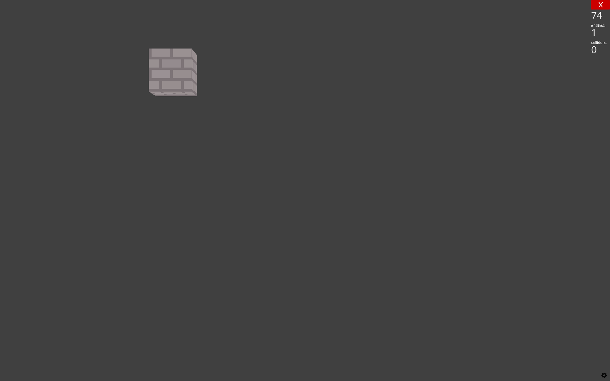

## 2. Clase 11: Rotation (Rotación)
La rotación implica girar un objeto alrededor de uno o más de sus ejes. En Ursina, esto se logra ajustando los atributos `rotation_x`, `rotation_y`, y `rotation_z`.

**Ejemplo:**

Para aplicar una textura de ladrillos (bricks) a un cubo en Ursina y permitir la configuración de los grados de rotación mediante una constante, sigue este código actualizado. Además, he añadido una constante `ROTATION_SPEED` que puedes modificar para ajustar cuántos grados quieres que el cubo rote con cada pulsación de tecla.

```python
from ursina import *

app = Ursina()

# Constante para la velocidad de rotación (grados por pulsación de tecla)
ROTATION_SPEED = 45

cube = Entity(model='cube', texture='brick', scale=(1,1,1))

def update():
    # Rotación en el eje x con 'a'
    if held_keys['a']:
        cube.rotation_x += ROTATION_SPEED * time.dt
    # Rotación en el eje y con 's'
    if held_keys['s']:
        cube.rotation_y += ROTATION_SPEED * time.dt
    # Rotación en el eje z con 'w'
    if held_keys['w']:
        cube.rotation_z += ROTATION_SPEED * time.dt

app.run()
```

### Descripción de las Teclas:

- **Tecla 'a'**: Rota el cubo sobre el eje `x`. Esto inclina el cubo adelante y atrás. La rotación se basa en la constante `ROTATION_SPEED`, permitiendo ajustes fáciles a la velocidad de rotación.
- **Tecla 's'**: Rota el cubo sobre el eje `y`. Esto gira el cubo hacia la izquierda y la derecha, también basado en `ROTATION_SPEED`.
- **Tecla 'w'**: Rota el cubo sobre el eje `z`. Esto inclina el cubo de lado a lado, utilizando igualmente `ROTATION_SPEED` para determinar la velocidad de rotación.

Con este enfoque, tienes un control flexible sobre la velocidad de rotación del cubo y puedes experimentar con diferentes grados de rotación para aumentar o reducir la velocidad de rotación.

**Resultado:**


Después de la rotación queda el siguiente rotación queda lo siguiente:


## 3. Clase 12: Scale (Escalado)
El escalado cambia el tamaño de un objeto. En Ursina, se puede escalar un objeto modificando sus propiedades `scale_x`, `scale_y`, y `scale_z`.

**Ejemplo:**

Para modificar el código de manera que, en lugar de rotar, cambie la escala del objeto (aumentando sus dimensiones en los ejes `x`, `y`, y `z`) cuando se presionan las teclas 'a', 's', y 'w', puedes hacer lo siguiente. También incluiré una constante `SCALE_SPEED` que determinará cuánto se ajusta la escala con cada pulsación de tecla. Aquí está el código actualizado:

```python
from ursina import *

app = Ursina()

# Constante para la velocidad de cambio de escala
SCALE_SPEED = 0.1

cube = Entity(model='cube', texture='brick', scale=(1,1,1))

def update():
    # Aumenta la escala en el eje x con 'a'
    if held_keys['a']:
        cube.scale_x += SCALE_SPEED * time.dt
    # Aumenta la escala en el eje y con 's'
    if held_keys['s']:
        cube.scale_y += SCALE_SPEED * time.dt
    # Aumenta la escala en el eje z con 'w'
    if held_keys['w']:
        cube.scale_z += SCALE_SPEED * time.dt

app.run()
```

Este código ajusta la escala del cubo en los ejes `x`, `y`, y `z` dependiendo de la tecla que se presione. La constante `SCALE_SPEED` se multiplica por `time.dt` para asegurar que el cambio de escala sea suave y proporcional al tiempo, lo que hace que el ajuste sea independiente de la tasa de fotogramas del juego.

### Descripción de las Teclas:

- **Tecla 'a'**: Aumenta la escala del cubo en el eje `x`, haciéndolo más ancho. La cantidad de ajuste está determinada por `SCALE_SPEED`.
- **Tecla 's'**: Aumenta la escala del cubo en el eje `y`, haciéndolo más alto. Esto también se basa en el valor de `SCALE_SPEED`.
- **Tecla 'w'**: Aumenta la escala del cubo en el eje `z`, haciéndolo más profundo. Al igual que con las otras dimensiones, el cambio depende de `SCALE_SPEED`.

Con este código, ahora tienes un cubo en Ursina que cambia su tamaño en lugar de rotar cuando se presionan las teclas especificadas, lo que te permite explorar cómo la escala de los objetos puede ajustarse dinámicamente en tiempo real.

**Resultado:**


Al modificar la escala se deforma.

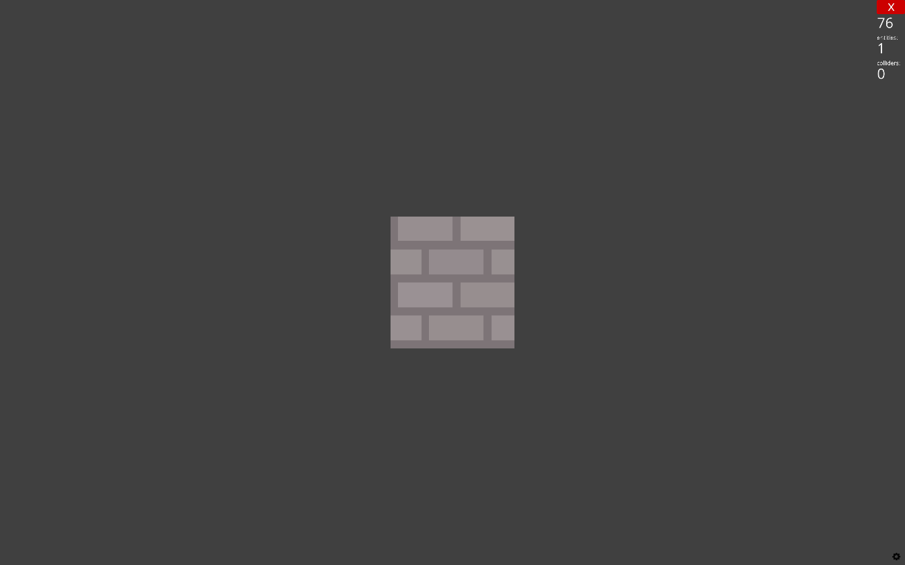

## Clase 13: Setting Boundaries for the Movement (Estableciendo límites para el movimiento)

En el contexto de un entorno de desarrollo de juegos o simulaciones 3D como Ursina, un cubo que se mueve de un lado a otro y rebota al alcanzar un límite se implementa mediante la actualización continua de su posición en el espacio tridimensional. Este movimiento se logra modificando las coordenadas del cubo (usualmente representadas por las variables `x`, `y`, y/o `z`) en cada cuadro o "tick" del juego, basándose en una velocidad o dirección predefinida. Cuando el cubo alcanza un límite específico del espacio de juego, que puede ser un valor de coordenada definido o el borde de la ventana de visualización, el algoritmo detecta esta condición y cambia la dirección del movimiento del cubo. Esto se realiza generalmente invirtiendo el signo de la velocidad en el eje correspondiente (por ejemplo, de positivo a negativo o viceversa), lo que hace que el cubo se mueva en la dirección opuesta. Este proceso de detección de límites y cambio de dirección se repite continuamente, creando un efecto de rebote donde el cubo va y viene dentro de los confines establecidos del espacio de juego.

**Código**

```python
from ursina import *

app = Ursina()

# Velocidad constante de movimiento del cubo
movement_speed = 0.1

# Límites de movimiento en el eje x
right_limit = 5
left_limit = -5

# Crea un cubo con textura de ladrillos
cube = Entity(model='cube', texture='brick', scale=(1,1,1))

def update():
    # Mueve el cubo en el eje x
    global movement_speed
    cube.x += movement_speed
    
    # Revisa si el cubo ha alcanzado alguno de los límites y cambia la dirección del movimiento
    if cube.x > right_limit or cube.x < left_limit:
        movement_speed *= -1

app.run()
```

**Resultado:**

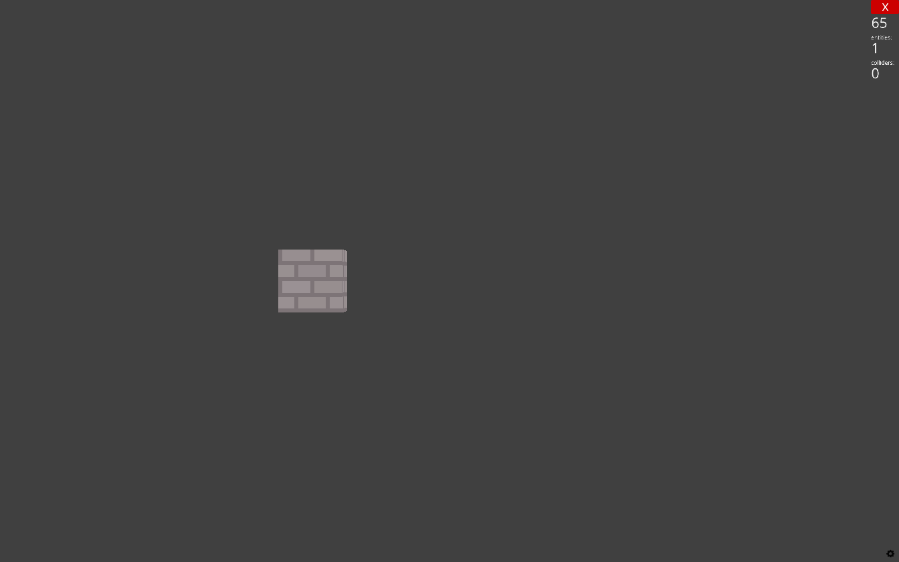

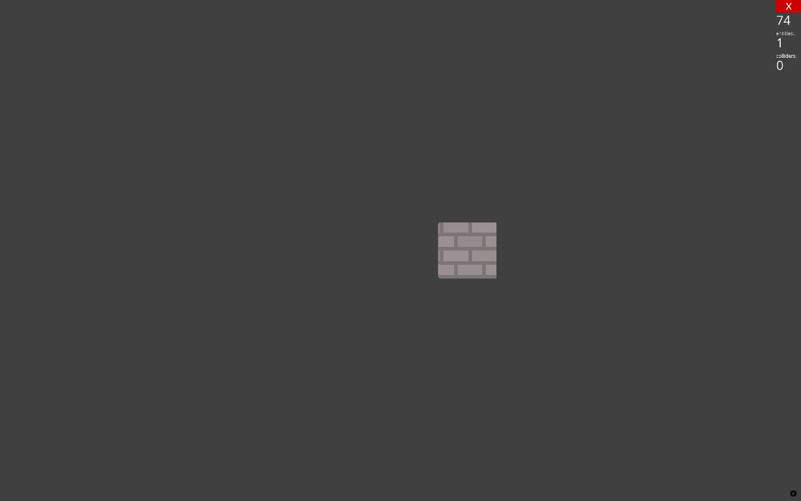

En imágenes no se puede apreciar, pero al llegar a cierto limite en `x` rebota y regresa siguiendo la dirección de `-x`.

# Referencias

Excelente guía rápida:

-  Ursina for dummies , https://www.ursinaengine.org/ursina_for_dummies.html

Una serie (playlist) de videos viejos de como usarlo pero muy funcionales:

- https://www.youtube.com/playlist?list=PLgQYnHnDxgtg-I3m01mGc5wfJwqpT9S3i

- [Grid CSS: Introducción - CSS en español - Lenguaje CSS](https://lenguajecss.com/css/maquetacion-y-colocacion/grid-css/)

