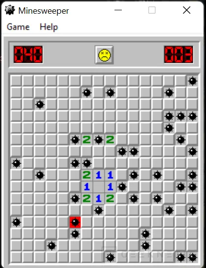

# Python_Ursina_documentation_with_examples
Esta documentación esta enfocada a como usar ursina de python, mediante ejemplos y explicaciones, complementado esta manera la documentación oficial.

# Clase 0: ¿Qué es ursina?

# Clase 1: Tú primer programa

Primero hay que hacer un entorno virtual

```
python -m venv venv
```

activar el entorno:

- **Winwdows: (powershell)**

```
.\venv\Scripts\Activate.ps1
```


Instalamos el motor

```
pip install ursina
```

tambíen hay que instalar para tener sonido (una alternativa, pero no es necesario, ya que ursina tiene para reproducir sonido)

```bash
pip install playsound
```


### Primer programa

```python
from ursina import * # Importa la aplicación del motor 

app = Ursina() # Inicializa tu aplicación Ursina

app.run() # Ejecuta la aplicación

```

El resultado es el siguiente


Felicidades haz hecho tu primer programa usando el motor ursina.


# 2.0 )Modelos Procedurales (Procedural Models)


La frase "Procedural Models" se traduciría al español como "Modelos Procedurales" o "Modelos Generados Procedimentalmente". En el contexto de gráficos por computadora, los modelos procedurales son aquellos que se crean utilizando algoritmos y reglas en lugar de ser modelados manualmente, lo que permite generar geometría de manera automática y eficiente.

**Clasificación en ursina:**

Con Ursina, un motor de juego en Python, es una excelente idea para visualizar las posibilidades de este framework. Aquí tienes una tabla con ejemplos de figuras tanto en 2D como en 3D:

| Tipo de Figura | Nombre de la Figura en Ursina | Descripción                                       |
| -------------- | ----------------------------- | ------------------------------------------------- |
| 2D             | `Entity`                      | Un objeto básico 2D, puede ser un sprite.         |
| 2D             | `Quad`                        | Un cuadrilátero o rectángulo 2D.                  |
| 2D             | `Circle`                      | Un círculo 2D.                                    |
| 3D             | `Entity`                      | Un objeto básico 3D, para modelos personalizados. |
| 3D             | `Cube`                        | Un cubo 3D.                                       |
| 3D             | `Sphere`                      | Una esfera 3D.                                    |
| 3D             | `Cylinder`                    | Un cilindro 3D.                                   |
| 3D             | `Cone`                        | Un cono 3D.                                       |
| 3D             | `Torus`                       | Un toro o anillo 3D.                              |

Cada una de estas figuras se puede personalizar en Ursina con diferentes texturas, colores y transformaciones (como escala, rotación y posición).

## 2.1) Clase 2 : Cuadrilatero( Quad)

**Forma básica** 

```python
from ursina import *

app = Ursina()

# Crear un Quad de tamaño 2x1 de color rojo
quad = Entity(model='quad', scale=(2, 1), color=color.red)

app.run()
```

La forma básica sólo sirve para poder apreciar lo que es quad, sin embargo quiero que visualices toda las dimensiones y por ello he realizado un segundo código que puedes rotar la entidad  para visualizar sus dimensiones.


Ahora un ejemplo con rotación usando las flechas del teclado para mover la vista (flecha derecha,izquierda rotar con respecto al eje "y", **flecha arriba,abajo**, rotar con respecto al eje "x").

```python
from ursina import *
from time import perf_counter

def update():
    # Controlar la rotación con las flechas del teclado
    if held_keys['left arrow']:
        quad_entity.rotation_y -= 1  # Rotar a la izquierda
    if held_keys['right arrow']:
        quad_entity.rotation_y += 1  # Rotar a la derecha
    if held_keys['up arrow']:
        quad_entity.rotation_x -= 1  # Rotar hacia arriba
    if held_keys['down arrow']:
        quad_entity.rotation_x += 1  # Rotar hacia abajo

app = Ursina()

# Crear una entidad con un modelo de Quad
#quad_entity = Entity(model=Quad(scale=(3, 1), thickness=3, segments=3, mode='line'), color=color.color(0, 1, 1, .7))

# Crear otra entidad con un modelo de Quad
quad_entity=Entity(scale=(3, 1), model=Quad(aspect=3), color=color.color(60, 1, 1, .3))


# Crear una entidad para representar el origen (0, 0)
origin = Entity(model='quad', color=color.orange, scale=(.05, .05))

# Ajustar la posición de la cámara
camera.z = -5

app.run()
```

Resultado:


**Notas:**

- Si se comenta la línea 18 y se des comenta la línea 21 da el anterior resultado, pero si se desea un `quad` sin color en el centro y sólo el perímetro de color rojo, se comenta la línea 21 y la línea 18 se comenta dando el siguiente resultado:


## 2.2)  Clase 3 :  Círculo  (circle)

En esta clase dibujaremos un círculo.


**Forma básica:**

Es la manera básica para construir un círculo  y que se muestre en la pantalla, sin más.

código: 

```python
# clase3.py
from ursina import *

app=Ursina()

entidad=Entity(model=Circle())

app.run()
```

Lo que se muestra es:


---

Sin embargo quiero analizar el ejemplo del que  es parte la documentación que es el siguiente:

```python
e = Entity(model=Circle(8, mode='line', thickness=10), color=color.color(60,1,1,.3))
print(e.model.recipe)
origin = Entity(model='quad', color=color.orange, scale=(.05, .05))
ed = EditorCamera(rotation_speed = 200, panning_speed=200)
```

Pero para visualizar sus características he colocado código adicional para poder rotar la figura (flecha derecha,izquierda rotar con respecto al eje "y", **flecha arriba,abajo**, rotar con respecto al eje "x"). El código quedaría de la siguiente manera:

```py
# clase3_con_movimiento.py
from ursina import *

def update():
    # Controlar la rotación con las flechas del teclado
    if held_keys['up arrow']:
        circle_entity.rotation_x += 1  # Rotar hacia arriba
    if held_keys['down arrow']:
        circle_entity.rotation_x -= 1  # Rotar hacia abajo
    if held_keys['left arrow']:
        circle_entity.rotation_y += 1  # Rotar a la izquierda
    if held_keys['right arrow']:
        circle_entity.rotation_y -= 1  # Rotar a la derecha

app = Ursina()

# Crear una entidad con un modelo de círculo
circle_entity = Entity(model=Circle(8, mode='line', thickness=20), color=color.color(60, 1, 1, .3))
# Imprimir la receta del modelo del círculo
print(circle_entity.model.recipe)

# Crear una entidad para representar el origen (0, 0)
origin = Entity(model='quad', color=color.orange, scale=(.05, .05))

# Usar EditorCamera para una mejor vista y navegación
ed = EditorCamera(rotation_speed=200, panning_speed=200)

app.run()

```

**El resultado:**


**Nota:** La resolución se refiere a cuantas líneas se usarán para conformar la figura del círculo que estamos diseñando, toma por ejemplo la siguiente figura


Si usáramos la resolución de 3, sería un triangulo, pero si tomaramos la resolución de 12 será un dodecágono, entre más tenga, parecerá más un círculo.

## 2.3) Clase 4 :  Plano (Plane) 

### Documentación


**Explicación:**

1. **Plane(Mesh):** Esta línea indica que `Plane` es una clase que hereda de `Mesh`. En Ursina, un `Mesh` es un objeto que define la forma de una entidad 3D. `Plane` es una especialización de `Mesh` que representa un plano o superficie.

2. **ursina/models/procedural/plane:** Esta es la ruta del módulo en el código fuente de Ursina donde se define la clase `Plane`.

3. **Plane(subdivisions=(1,1), mode='triangle', **kwargs):** Aquí se describe el constructor de la clase `Plane`. Puedes crear un nuevo `Plane` especificando ciertos parámetros:
   - **subdivisions=(1,1):** Este parámetro define el número de subdivisiones del plano en los ejes X e Y. Un valor de `(1,1)` significa que el plano es un cuadrado o rectángulo simple sin subdivisiones internas. Si aumentas estos valores, el plano se dividirá en más cuadrados o rectángulos, lo que puede ser útil para ciertos efectos o detalles.
   - **mode='triangle':** Este parámetro define cómo se construye el plano a nivel de malla. El valor predeterminado `'triangle'` significa que el plano se compone de triángulos. Otras opciones podrían incluir 'line' o 'point', dependiendo de cómo quieras que se visualice la malla.
   - **\*\*kwargs:** Esto significa que puedes pasar argumentos adicionales que son aceptados por la clase base `Mesh` o por otras clases de las que `Plane` podría heredar.

4. **.vertices, self.triangles = list(), list():** Aquí se inicializan las listas de vértices y triángulos del plano. 

5. **.uvs = list():** Esta línea inicializa la lista de coordenadas UV, que se utilizan para mapear texturas en la superficie del plano. 

### Código más simple

```python
# clase4.py
from ursina import *

app = Ursina()

# Crear un plano básico
plane =  Entity(model=Plane(),rotation_x=-90)

app.run()
```

**Resultado:**


Es un plano  simple sin color, de 1x1, sin embargo se necesitó rotar debido a que como el plano esta contenido hacia los vértices x,y, no se puede visualizar es por ello que se realiza una rotación de 90° para lograrlo visualizar.

### Código de la documentación

El código es obtenido de la documentación oficial:

```python
front =  Entity(model=Plane(subdivisions=(3,6)), texture='brick', rotation_x=-90)

_ed = EditorCamera()
Entity(model='cube', color=color.green, scale=.05)
```

Pero es necesario modificarlo para apreciar todas las dimensiones que posee, quedando como resultado el siguiente código:

```python
# clase4_con_movimiento.py
from ursina import *

def update():
    # Controlar la rotación con las flechas del teclado
    if held_keys['up arrow']:
        front.rotation_x += 1  # Rotar hacia arriba en el eje X
    if held_keys['down arrow']:
        front.rotation_x -= 1  # Rotar hacia abajo en el eje X
    if held_keys['left arrow']:
        front.rotation_y += 1  # Rotar a la izquierda en el eje Y
    if held_keys['right arrow']:
        front.rotation_y -= 1  # Rotar a la derecha en el eje Y

app = Ursina()

# Crear un plano con subdivisiones y aplicar una textura
front = Entity(model=Plane(subdivisions=(3,6)), texture='brick', rotation_x=-90)

# EditorCamera para una mejor vista y navegación
_ed = EditorCamera()

# Crear una entidad que representa el origen (0, 0, 0)
Entity(model='cube', color=color.green, scale=.05)

app.run()

```

###  **Resultado:**


Cómo se observa tiene textura que viene incluida en el motor de ursina, pero además tiene división 3x6 y esta rotado 90 grados, para poder visualizarse.

## 2.4) Clase 5 : Grid (Rejilla) 

Aunque claramente la traducción de **rejilla** no es precisamente correcta es el termino que más se le parece a lo que trata de representar el elemento, para mi es más fácil tratar de especificar que es este tipo de elementos a partir de un ejemplo, para ello observa las siguientes tres imágenes (viendo que tienen en común):

Imagen 1)


Imagen 2)


Imagen 3)



¿Lo adivinaste? Las imágenes están formadas por cuadriculas para organizar, referenciar la posición de los elementos, toma como idea el `grid` de `CSS` :


Si yo quisiera  iluminar los cuadros rojos de la imagen anterior porque es lava en un videojuego, podría usar `grid` especificando la posición de los recuadros rojos  y con ello realizar una acción, es decir que nos sirve construir el escenario que estamos planeando.

**Código básico:**

```python
# Clase5.py
from ursina import *

app = Ursina()

grid = Entity(model=Grid(2, 6))

app.run()
```

el resultado es el siguiente:


Un grid únicamente mostrando las divisiones, 2 divisiones de ancho y  6 de alto, en este caso es indispensable especificar el número de divisones tanto vertical como horizontalmente.

**Código de la documentación:**

```python
Entity(model=Grid(2, 6))
```

`Entity(model=Grid(2, 6))`: Este es un ejemplo de cómo crear una entidad (objeto en la escena) utilizando la clase `Grid` como su modelo. Aquí se crea una entidad con una rejilla que tiene una anchura de 2 unidades y una altura de 6 unidades. En `ursina`, una `Entity` es un objeto general que puede tener un modelo, una textura, una posición, etc., y al asignarle un modelo `Grid`, se convierte en una representación visual de la rejilla en la escena.

**Versión modificada del código de la documentación:**

Para el caso de este código se mostrará un caso de ejemplo de una cuadricula de colores que es posible interactuar mediante el mouse en cada uno de los diferentes cuadros (dando click izquierdo) , además es posible rotar la cuadricula con las flechas (flecha **derecha,izquierda** rotar con respecto al eje "y", **flecha arriba,abajo**, rotar con respecto al eje "x").

```python
# clase5_con_movimiento.py
from ursina import *

def update():
    # Rotar en el eje Y (izquierda / derecha)
    if held_keys['left arrow']:
        grid.rotation_y += time.dt * 100
    if held_keys['right arrow']:
        grid.rotation_y -= time.dt * 100

    # Rotar en el eje X (arriba / abajo)
    if held_keys['up arrow']:
        grid.rotation_x += time.dt * 100
    if held_keys['down arrow']:
        grid.rotation_x -= time.dt * 100

app = Ursina()

# Crear un grid
grid = Entity()

# Crear cuadrados en el grid y asignarles colores aleatorios
for y in range(5):
    for x in range(5):
        b = Button(parent=grid, position=(x, y), color=color.random_color())

# Asegurarse de que la cámara no rota con el grid
camera.parent = scene

app.run()
```

el resultado se muestra a continuación:


**Tomando la documentación oficial:**

Vamos a tomar la documentación para tomar esto con verdadero y extender nuestro entendimiento de clase (**puedes omitirlo si deseas**)


De la documentación vemos lo siguiente:

- `Grid(Mesh)`: Esto indica que `Grid` es una clase que probablemente hereda de `Mesh` o está relacionada con la creación de una malla (mesh), que es una estructura compuesta de vértices, aristas y caras que define la forma de un objeto poligonal en 3D.
- `ursina/models/procedural/grid`: Esta es la ruta donde se encuentra definida la clase `Grid` dentro de la estructura de directorios del paquete `ursina`. `models/procedural/grid` sugiere que es un modelo procedimental, es decir, que se genera automáticamente a través de código en lugar de ser modelado a mano.
- `Grid(width, height, mode='line', thickness=1, **kwargs)`: Esta es la declaración de la función constructora de la clase `Grid`. Aquí están los parámetros que puedes especificar al crear una nueva instancia de `Grid`:

  - `width`: La anchura de la rejilla en unidades de la escena.
  - `height`: La altura de la rejilla en unidades de la escena.
  - `mode='line'`: El modo en el que se dibuja la rejilla. El valor predeterminado `'line'` significa que la rejilla se representará como una serie de líneas.
  - `thickness=1`: El grosor de las líneas de la rejilla. Por defecto es 1.
  - `**kwargs`: Esto permite pasar argumentos adicionales que la clase `Grid` puede aceptar o que se pueden pasar a la clase base.
- `.width = width`: Es una propiedad de la instancia de `Grid` que define su anchura.
- `.height = height`: Es una propiedad de la instancia de `Grid` que define su altura.

## 2.5) Cone

## 2.6) Cylinder

## 2.7) Pipe 

## 2.8 ) Terrain


# Clase 3 Trasformaciones básicas


# Referencias

Excelente guía rapida:

-  Ursina for dummies , https://www.ursinaengine.org/ursina_for_dummies.html

Una serie (playlist) de videos viejos de como usarlo pero muy funcionales:

- https://www.youtube.com/playlist?list=PLgQYnHnDxgtg-I3m01mGc5wfJwqpT9S3i

- [Grid CSS: Introducción - CSS en español - Lenguaje CSS](https://lenguajecss.com/css/maquetacion-y-colocacion/grid-css/)

